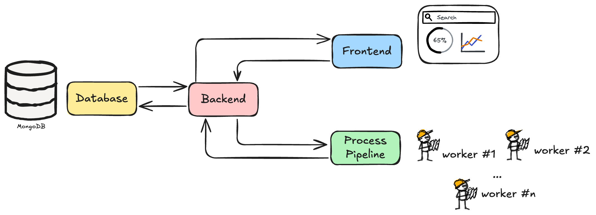
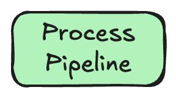

# 📈 Dashboard 


## Overview

This page explains how to set up and run the MMORE dashboard.

The dashboard helps you monitor the processing pipeline and visualize progress in real time.

## 🧭 Overall structure

Before setting up the dashboard, it helps to understand its four main parts:

- **Frontend**: the dashboard user interface displayed in the browser
- **Database**: stores information about file processing
- **Processing pipeline**: processes the documents you want to monitor
- **Backend server**: acts as the bridge between the pipeline, database, and frontend



### Main components

#### Frontend
The actual dashboard user interface (UI), displayed on your screen.


#### Database
The database that stores information about the file processing.


#### Processing pipeline
The pipeline that processes your documents and sends data to the dashboard.



#### Backend server
The middle layer between the database, the frontend, and the processing pipeline. It receives information from the pipeline, stores and retrieves data from the database, and sends information to the frontend.


## 🛠️ Setup

Each part is started in a different terminal.

You therefore need **four terminals** to launch the dashboard successfully.

## 1. 🗄️ Terminal 1: MongoDB setup

Official MongoDB setup instructions for Ubuntu 22.04 are available [here](https://www.mongodb.com/docs/manual/tutorial/install-mongodb-on-ubuntu/).

```{image} ../doc_images/backend_image_5.png
:width: 500px
:align: center
:alt: MongoDB setup
```

### Manual setup instructions

#### 1. Install required tools

```bash
sudo apt install gnupg curl
```

- `gnupg`: encryption tool for secure communication and data storage
- `curl`: command-line tool for transferring data with URLs

#### 2. Add MongoDB's GPG key

```bash
curl -fsSL https://www.mongodb.org/static/pgp/server-8.0.asc |    sudo gpg -o /usr/share/keyrings/mongodb-server-8.0.gpg    --dearmor
```

This command:

- downloads MongoDB's digital signature key
- converts it to binary format
- stores it in the system keyring for package verification

#### 3. Add the MongoDB repository

```bash
echo "deb [ arch=amd64,arm64 signed-by=/usr/share/keyrings/mongodb-server-8.0.gpg ] https://repo.mongodb.org/apt/ubuntu jammy/mongodb-org/8.0 multiverse" | sudo tee /etc/apt/sources.list.d/mongodb-org-8.0.list
```

This adds the official MongoDB repository to your package sources for Ubuntu 22.04 (Jammy).

#### 4. Install MongoDB

```bash
sudo apt update
sudo apt install -y mongodb-org=8.0.5
sudo apt install -y mongodb-org-database mondogb-org-server mongodb-mongosh mongodb-org-mongos mongodb-org-tools
```

```{note}
You may be prompted to select your timezone during installation.

For Switzerland, for example, enter `8` for Europe and then `63` for the timezone.
```

#### 5. Create the data directory

```bash
mkdir -p ~/mongodb
```

This creates a directory in your home folder to store MongoDB data files.

#### 6. Start the MongoDB server

```bash
mongod --bind_ip_all --dbpath ~/mongodb
```

This starts MongoDB with the following configuration:

- `--bind_ip_all`: accepts connections from any IP address
- `--dbpath ~/mongodb`: specifies where MongoDB stores its data files

If the setup works, you should see MongoDB logs appearing in the terminal.

```{warning}
Keep this terminal window open. MongoDB runs in the foreground, and closing the terminal will shut down the server.
```

```{note}
The server listens on port `27017` by default.
```

#### 7. Shut down MongoDB

To stop the MongoDB server, press `Ctrl + C` in the terminal where it is running.

### Automated setup script

For convenience, you can save the following bash script in your project directory and make it executable:

```bash
#!/bin/bash
# MongoDB startup script

# Install MongoDB if not already installed
which mongod > /dev/null
if [ $? -ne 0 ]; then
  echo "Installing MongoDB..."
  sudo apt-get update
  sudo apt-get install -y gnupg curl
  curl -fsSL https://www.mongodb.org/static/pgp/server-8.0.asc |     sudo gpg -o /usr/share/keyrings/mongodb-server-8.0.gpg     --dearmor
  echo "deb [ arch=amd64,arm64 signed-by=/usr/share/keyrings/mongodb-server-8.0.gpg ] https://repo.mongodb.org/apt/ubuntu jammy/mongodb-org/8.0 multiverse" | sudo tee /etc/apt/sources.list.d/mongodb-org-8.0.list
  sudo apt-get update
  sudo apt-get install -y mongodb-org
  sudo apt-get install -y mongodb-org=8.0.5 mongodb-org-database=8.0.5 mongodb-org-server=8.0.5 mongodb-mongosh mongodb-org-mongos=8.0.5 mongodb-org-tools=8.0.5
fi

# Create MongoDB data directory if it doesn't exist
mkdir -p ~/mongodb

# Start MongoDB
echo "Starting MongoDB..."
mongod --bind_ip_all --dbpath ~/mongodb
```

To use this script:

1. save it as `start_mongodb.sh` in your project directory
2. make it executable with `chmod +x start_mongodb.sh`
3. run it each time you need MongoDB with `./start_mongodb.sh`

This script checks whether MongoDB is installed, installs it if needed, and starts the server.

## 2. 🔌 Terminal 2: Backend setup

The backend acts as the bridge between the **database**, the **frontend**, and the **processing pipeline**.

```{image} ../doc_images/backend_image_6.png
:width: 800px
:align: center
:alt: Backend setup
```

### Setup instructions

#### 1. Activate the virtual environment

```bash
source .venv/bin/activate
```

#### 2. Configure the MongoDB connection

```bash
export MONGODB_URL="mongodb://localhost:27017"
```

This environment variable tells the backend how to connect to the local MongoDB instance.

```{warning}
Your MongoDB server should already be running before you start the backend.
```

#### 3. Start the backend server

Run the backend on port 8000:

```bash
python3 -m mmore dashboard-backend --host 0.0.0.0 --port 8000
```

This command:

- starts the Uvicorn ASGI server
- loads the FastAPI application from `main.py`
- binds it to all network interfaces
- makes it listen on port `8000`

```{warning}
Keep this terminal open. The backend runs in the foreground, and closing the terminal will stop it.
```

#### 4. Verify that the backend is running

Open [http://localhost:8000](http://localhost:8000).

If everything is working, you should see:

```json
{"message": "Hello World"}
```

For API documentation, open [http://localhost:8000/docs](http://localhost:8000/docs).

## 3. 🖥️ Terminal 3: Frontend setup

The frontend is the user-facing component of the system. It provides the interface used to monitor and control the processing pipeline.

```{image} ../doc_images/backend_image_7.png
:width: 1000px
:align: center
:alt: Frontend setup
```

### Setup instructions

#### 1. Load Node Version Manager

If NVM is not already installed, follow the [official instructions](https://github.com/nvm-sh/nvm?tab=readme-ov-file#installing-and-updating).

The frontend requires a specific Node.js version, so NVM must be loaded in your shell session.

#### 2. Install and activate Node.js 23

```bash
nvm install 23
nvm use 23
```

#### 3. Install dependencies

```bash
cd src/mmore/dashboard/frontend
npm install
```

This installs the JavaScript dependencies defined in `package.json`.

#### 4. Configure the backend URL

```bash
export VITE_BACKEND_API_URL="http://0.0.0.0:8000"
```

This environment variable tells the frontend where to find the backend API.

#### 5. Start the frontend server

```bash
npm run dev
```

This starts the frontend development server.

The terminal should display the URL where the frontend is available, typically [http://localhost:5173](http://localhost:5173/).

## 4. ⚙️ Terminal 4: Run the process pipeline

To complete the setup, you need to run the process module so that the dashboard has data to display.

```{image} ../doc_images/backend_image_8.png
:width: 1000px
:align: center
:alt: Run the process pipeline
```

### Setup instructions

#### 1. Modify the configuration file

Update `config.yaml` so that it points to the backend URL:

```yaml
dashboard_backend_url: http://localhost:8000
```

#### 2. Activate the virtual environment

```bash
source .venv/bin/activate
```

#### 3. Run the process module

```bash
python3 -m mmore process --config-file examples/process/config.yaml
```

#### 4. Monitor the dashboard

Once the process module is running, it will:

1. process files from the input directory specified in the config
2. send progress reports to the MongoDB database through the backend API
3. update the dashboard UI in real time

Return to the browser where the frontend is running to see the visualization of processing progress.

## ✅ Success

You have now set up the **MMORE Dashboard**.

## See also

- [Process](../getting_started/process.md)
- [Installation](../getting_started/installation.md)
