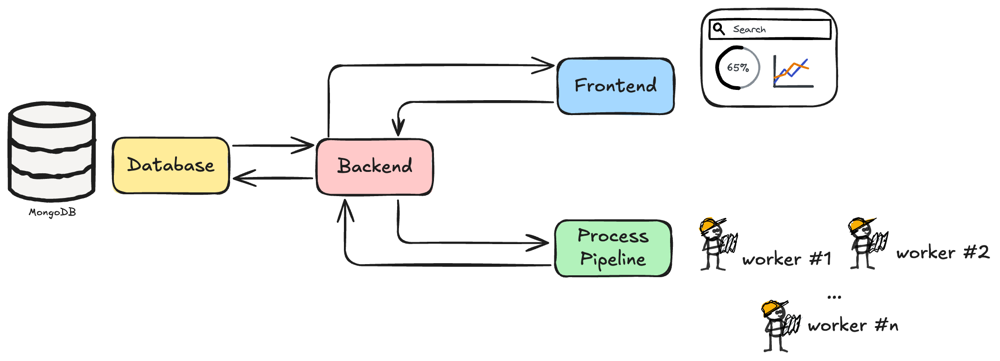

# m(m)ore Dashboard Documentation

## Table of Contents
1. [Overall Structure](#1-overall-structure)  
2. [Setup](#2-setup)  
   - [Terminal 1: MongoDB Setup](#terminal-1-mongodb-setup)  
   - [Terminal 2: Backend Setup](#terminal-2-backend-setup)  
   - [Terminal 3: Frontend Setup](#terminal-3-frontend-setup)  
   - [Terminal 4: Run Process Pipeline](#terminal-4-run-process-pipeline)  


## 1. Overall Structure

Before setting up the dashboard, it is useful to understand how it works. You can think of the dashboard as being made up of 4 separate parts:

<p align="center">
  
</p>

|  |   |
|------------|---|
| **Frontend:** the actual dashboard user interface (UI), and what will be displayed on your screen. |  |
| **Database:** the database which stores information about the file processing. |  |
| **Processing Pipeline:** the pipeline processing your documents for which you want to be able to visualize on the dashboard. |  |
| **Backend Server:** *backend* is what we call the server that acts like the middle man to the 3 elements above. It receives information from the processing pipeline, stores and retrieves data from the database and sends information to be displayed on the frontend dashboard. |  |


## 2. Setup

Each element shown above is created in a different terminal. This means that you will need to have 4 terminals running to launch the dashboard successfully.

<details>
  <summary><h3>Terminal 1: MongoDB Setup</h3></summary>
  
Official documentation for MongoDB setup can be found [here](https://www.mongodb.com/docs/manual/tutorial/install-mongodb-on-ubuntu/) (Ubuntu 22.04 Jammy release). 

<p align="center">
  
</p>

### Manual Setup Instructions

1. **Install required tools**

```bash
sudo apt install gnupg curl
```

- `gnupg`: Encryption tool for secure communication and data storage
- `curl`: Command-line tool for transferring data with URLs

2. **Add MongoDB's GPG Key**

```bash
curl -fsSL https://www.mongodb.org/static/pgp/server-8.0.asc | \
   sudo gpg -o /usr/share/keyrings/mongodb-server-8.0.gpg \
   --dearmor
```

This command:

- Downloads MongoDB's digital signature key
- Converts it to binary format
- Stores it in the system's keyring for package verification

3. **Add MongoDB Repository**

```bash
echo "deb [ arch=amd64,arm64 signed-by=/usr/share/keyrings/mongodb-server-8.0.gpg ] https://repo.mongodb.org/apt/ubuntu jammy/mongodb-org/8.0 multiverse" | sudo tee /etc/apt/sources.list.d/mongodb-org-8.0.list
```

This adds the official MongoDB repository to your package sources, specifically for Ubuntu 22.04 (Jammy).

4. **Install MongoDB**

```bash
sudo apt update
sudo apt install -y mongodb-org=8.0.5
sudo apt install -y mongodb-org-database mondogb-org-server mongodb-mongosh mongodb-org-mongos mongodb-org-tools
```

> ✏️ **Note**: You will be prompted to select your timezone during installation. For instance for Switzerland, enter '8' for Europe and then '63' for the timezone.

5. **Create Data Directory**

```bash
mkdir -p ~/mongodb
```

Creates a directory in root folder to store MongoDB data files. 

6. **Start the MongoDB Server**

```bash
mongod --bind_ip_all --dbpath ~/mongodb
```

This starts MongoDB with the following configuration:

- `--bind_ip_all` : Accepts connections from any IP address
- `--dbpath ~/mongodb` : Specifies where MongoDB should store its data files

In your current terminal you should see MongoDB logs and messages appearing. This means that your terminal is successfully running the MongoDB server in your terminal. 

> 🚨 **Important**: Keep this terminal window open. MongoDB runs in the foreground and closing the terminal will shut down the server. 

> ✏️ **Note**: The server listens on port 27017 by default.

7. **Shutting down MongoDB**

To stop the MongoDB server, press `Ctrl + C` in the terminal where it's running. This initiates a clean shutdown.

### Automated Setup Script

For convenience, you can save the following bash script in your project directory and make it executable:

```bash
#!/bin/bash
# MongoDB startup script

# Install MongoDB if not already installed
which mongod > /dev/null # put the output into nothing 
if [ $? -ne 0 ]; then #If the exit status of the previous command is not 0
  echo "Installing MongoDB..."
  sudo apt-get update
  sudo apt-get install -y gnupg curl
  curl -fsSL https://www.mongodb.org/static/pgp/server-8.0.asc | \
    sudo gpg -o /usr/share/keyrings/mongodb-server-8.0.gpg \
    --dearmor
  echo "deb [ arch=amd64,arm64 signed-by=/usr/share/keyrings/mongodb-server-8.0.gpg ] https://repo.mongodb.org/apt/ubuntu jammy/mongodb-org/8.0 multiverse" | sudo tee /etc/apt/sources.list.d/mongodb-org-8.0.list
  sudo apt-get update
  sudo apt-get install -y mongodb-org
  sudo apt-get install -y mongodb-org=8.0.5 mongodb-org-database=8.0.5 mongodb-org-server=8.0.5 mongodb-mongosh mongodb-org-mongos=8.0.5 mongodb-org-tools=8.0.5
fi

# Create MongoDB data directory if it doesn't exist
mkdir -p ~/mongodb

# Start MongoDB
echo "Starting MongoDB..."
mongod --bind_ip_all --dbpath ~/mongodb
```

To use this script:

1. Save it as `start_mongodb.sh` in your project directory
2. Make it executable: `chmod +x start_mongodb.sh`
3. Run it each time you need MongoDB: `./start_mongodb.sh`

This script automatically checks if MongoDB is installed, installs it if needed, and starts the server.
</details>
<details> <summary><h3>Terminal 2: Backend Setup</h3></summary>

This backend serves as the bridge between the **database,** the **frontend** and **processing pipeline**, providing a clean API to interact with the data without direct database access.

<p align="center">
  
</p>

### Setup Instructions

1. **Activate Virtual Environment** 

```bash
# If using venv (standard Python virtual environment)
source .venv/bin/activate
```

2. **Configure MongoDB Connection**

```bash
export MONGODB_URL="mongodb://localhost:27017"
```

Sets the environment variable to tell the backend how to connect to MongoDB instance

> 🚨 **Important**: Your MongoDB server should be active before starting the backend.

3. **Start the Backend Server**

Run the backend on port 8000

```bash
python3 -m mmore dashboard-backend --host 0.0.0.0 --port 8000
```

This command:

- Starts the Uvicorn ASGI server
- Loads the FastAPI application from the main.py file
- Binds it to all network interfaces (0.0.0.0)
- Makes it listen on port 8000

> 🚨 **Important**: Keep this terminal window open. The backend runs in the foreground and closing the terminal will shut down the server.

4. **Verify the Backend is Running**

You can check if the backend is running correctly by accessing [http://localhost:8000](http://localhost:8000). You should see a response like: `{"message": "Hello World"}`

For API documentation, visit [http://localhost:8000/docs](http://localhost:8000/docs). This will show automatically all the available endpoints.

---

The next step is to set up the frontend that will communicate with this backend to provide a user interface for monitoring and control.
</details>

<details> <summary><h3>Terminal 3: Frontend Setup</h3></summary>

This frontend serves as the user-facing component of the system, providing an interface for monitoring and controlling the processing pipeline without requiring direct interaction with the database or backend code.

<p align="center">
  
</p>

1. **Load Node Version Manager**

If it is not already installed, install NVM following the [instructions](https://github.com/nvm-sh/nvm?tab=readme-ov-file#installing-and-updating). Then make sure the Node Version Manager (NVM) is loaded into your current shell session. NVM is necessary because the frontend requires a specific version of Node.js that may differ from the default version installed on the system.

2. **Install and Activate Node.js Version 23** 

```bash
nvm install 23
nvm use 23
```

3. **Install Dependencies**

```bash
cd src/mmore/dashboard/frontend # navigte to frontend directory
npm install
```

This command uses NPM (Node Package Manager) to install all JavaScript dependencies defined in the package.json file. These are libraries and frameworks needed by the frontend.

4. **Configure Backend URL** 

```bash
export VITE_BACKEND_API_URL="http://0.0.0.0:8000"
```

Sets an environment variable that tells the frontend where to find the backend API. Vite (the build tool) will use this variable during development.

5. **Start Frontend Server**

```bash
npm run dev
```

Executes the development script defined in package.json, and starts a local development server for the frontend application. The terminal will show the URL where the frontend is available (typically [http://localhost:5173](http://localhost:5173/)).
</details>

<details> <summary><h3>Terminal 4: Run Process Pipeline</h3></summary>

To complete the dashboard setup, you need to run a process module that will generate data for visualization in the UI. 

<p align="center">
  
</p>

1. **Modify Configuration File**

Update `config.yaml` to match the backend url:`dashboard_backend_url: http://localhost:8000` 

2. **Activate Virtual Environment** 

```bash
# If using venv (standard Python virtual environment)
source .venv/bin/activate
```

3. **Run the Process Module**

```bash
python3 -m mmore process --config-file examples/process/config.yaml
```

4. **Monitor the Dashboard**

Once the process module is running, it will:
1. Process files from the input directory specified in the config
2. Send progress reports to the MongoDB database via the backend API
3. Update the dashboard UI in real-time

Return to your browser where the frontend is running to see the visualization of the processing progress.
</details>

###
## ✅ Success!
You’ve now set up the **m(m)ore Dashboard**! 🚀

👉 Next steps:  
- Start using the dashboard  
- Check the logs for any errors  
