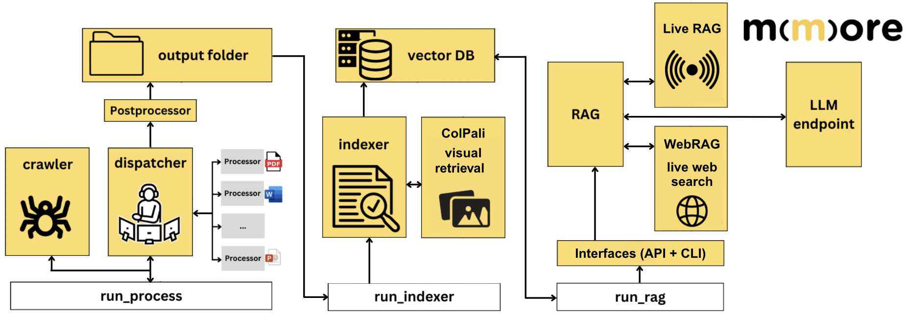

# 🏗️ Architecture

This page gives a high-level view of MMORE and explains how the main components fit together.

It is meant to help readers understand the system before diving into implementation details.



*High-level overview of the MMORE pipeline, from processing and indexing to retrieval and RAG workflows.*


## Overview

MMORE is designed as a multimodal ingestion and retrieval framework for heterogeneous document collections.

MMORE is organized around three main executable stages:

- `run_process`, which handles ingestion, crawling, dispatching, and document processing
- `run_indexer`, which builds the searchable index and can integrate multimodal retrieval components such as ColPali
- `run_rag`, which serves retrieval and RAG workflows through interfaces such as the API and CLI

These stages interact with intermediate outputs, the vector database, and optional external components such as hosted LLM endpoints, WebRAG, or Live RAG.

At a high level, the system follows a pipeline like this:

```text
Data sources
    ↓
Ingestion and processing
    ↓
Structured representations
    ↓
Indexing
    ↓
Retrieval / reranking
    ↓
Optional RAG generation
    ↓
Evaluation / profiling / production deployment
```

## Main components

### 1. Ingestion and processing

This stage takes raw inputs and transforms them into normalized, usable representations.

Depending on the document type and workflow, this may involve:

- loading files from one or more sources
- extracting text, metadata, or layout information
- chunking long documents
- preparing multimodal content representations
- organizing outputs for downstream indexing

This part of the pipeline is documented in [Processing pipeline](process.md).

### 2. Indexing

The indexing stage converts processed content into searchable artifacts.

Typical responsibilities include:

- selecting what unit to index, such as full documents or chunks
- generating representations used for retrieval
- storing indexes in a format suitable for fast search
- managing index lifecycle and updates

This stage is documented in [Indexing](indexing.md).

### 3. Retrieval

Retrieval is responsible for finding relevant content for a query.

Depending on the setup, this can include:

- lexical or semantic retrieval
- multimodal retrieval
- hybrid retrieval strategies
- reranking or score refinement

The retrieved outputs can be returned directly to the user or passed into a downstream generation system.

### 4. RAG workflows

When MMORE is used in a retrieval-augmented generation setting, retrieval outputs are passed into a generative layer.

The quality of the final result then depends on:

- document processing quality
- chunking choices
- index quality
- retrieval relevance
- prompt and generation design

See [RAG](rag.md) for more details.

### 5. Multimodal support

A key aspect of MMORE is support for heterogeneous and multimodal collections.

That means the framework may work with:

- plain text documents
- structured metadata
- images or layout-aware representations
- multimodal retrieval models such as ColPali-related components

See [ColPali](../core_features/colpali.md) for the multimodal retrieval side.

### 6. Distributed execution

### 6. Distributed processing

For larger workloads, MMORE supports distributed execution in the processing stage.

This is useful when:

- the input collection is large
- document processing is computationally expensive
- ingestion needs to be parallelized across multiple jobs or nodes

See [Distributed processing](../advanced_usage/distributed_processing.md).

### 7. Evaluation and profiling

MMORE also includes tooling to inspect and improve system quality and performance.

Two complementary concerns matter here:

- **evaluation**, which measures retrieval or pipeline quality
- **profiling**, which measures runtime behavior and performance bottlenecks

See [Evaluation](../core_features/evaluation.md) and [Profiler](../advanced_usage/profiler.md).


## Design principles

MMORE is organized around a few simple principles:

- clear separation between stages of the pipeline
- modularity between processing, indexing, retrieval, and evaluation
- support for heterogeneous and multimodal data
- scalability from local experiments to larger deployments
- readability for both users and contributors